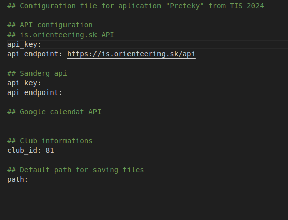
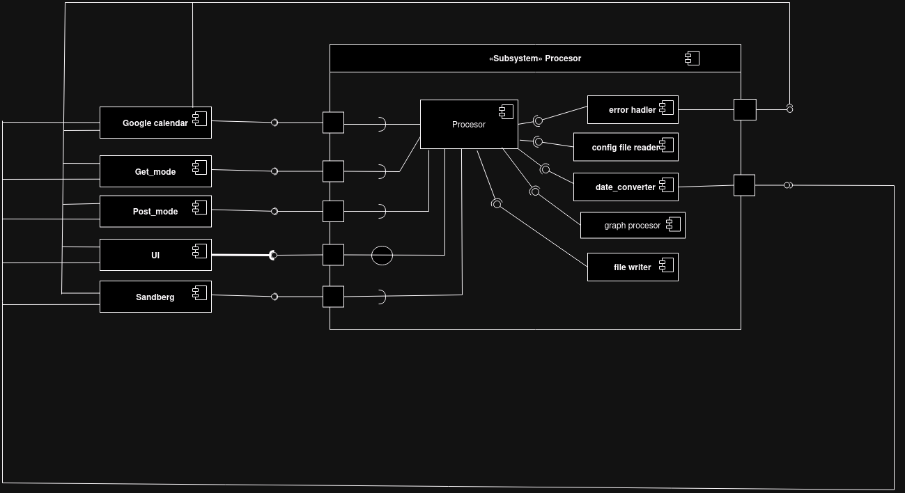
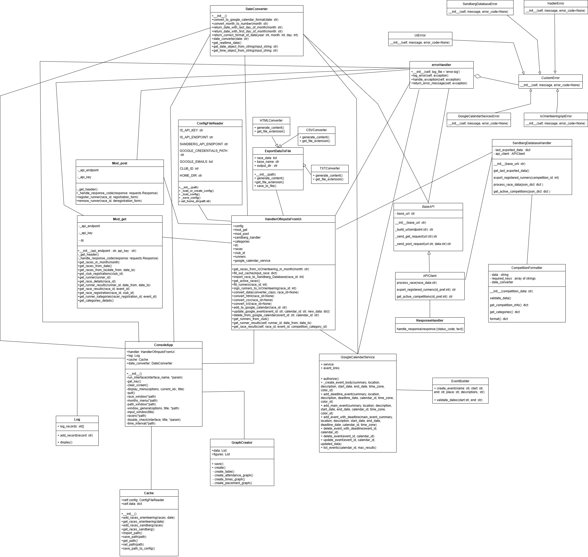

# Návrh
## 1 Úvod
## 1.1 Účel návrhu
Tento dokument slúži ako detailný návrh informačného systému pre projekt “Aplikácia pre import a export údajov z databázy termínov pretekov”. Systém je vyvíjaný pre Športový klub Sandberg a je súčasťou predmetu Tvorba informačných systémov na FMFI UK v akademickom roku 2024/2025. Dokument obsahuje všetky potrebné informácie týkajúce sa implementácie, fungovania a dizajnu systému. Je určený predovšetkým pre vývojárov, ktorí budú systém realizovať a zahŕňa všetky požiadavky uvedené v katalógu požiadaviek.

## 1.2 Rozsah využitia systém
Tento dokument je úzko prepojený s katalógom požiadaviek a špecifikuje všetky požiadavky, ktoré sú v ňom uvedené. Okrem toho definuje vonkajšie rozhrania, formáty súborov a potrebné API pre správnu funkčnosť systému. Dokument tiež obsahuje návrh používateľského rozhrania konzolovej aplikácie vrátane vizualizácií a diagramov, ktoré detailne popisujú implementáciu systému.

## 1.3 Referencie
- Github repozitár projektu zameraného na tvorbu systému Športového klubu Sandberg z roku 2017: 
    [https://github.com/TIS2017/SportovyKlub](https://github.com/TIS2017/SportovyKlub)
- Github repozitár projektu z roku 2023, ktorí menili časť databázy:
    [https://github.com/TIS2023-FMFI/sportovy-pretek-web](https://github.com/TIS2023-FMFI/sportovy-pretek-web)
- [API roznhranie is.orientering.sk](https://github.com/TIS2024-FMFI/preteky/tree/main/API/is.orienteering.sk)
## 2 Návrh komunikácie medzi konzolovou aplikáciou a stránkou is.orienteering.sk 
V tejto kapitole sa venujeme komunikácí so stránkou [is.orieteering.sk](is.orienteering.sk) pomocou restfull API. Všetku komunikáciu vieme rozdeliť na dva módy: Get a Post. Komunikácia je zabezpečená skrz bezpečnostný klúč ktorý je uložený v config súbore

#### Mód Get
- používame keď získavame dáta z is.orienteering.sk
- na každý request bude samostantná funkcia
- funkcie vracajú JSON string
- ako parametre funkcí vkladamáme udaje na zaklade ktorých chceme dáta z is.orienteering.sk filtrovať
- requesty:
	- preteky v mesiaci
    		- podla mesiaca, ktorý zadáme	 
    	- registracie (registrovaný pretekáry) v danom klube
    		- podla id klubu
	- detailné informácie o pretekárovy
 		- podla id pretekara
   	- detaily pretekov
   		- podla id pretekov
   	- vysledky pretekára v intervale medzi dvoma dátumami
   		- podla id pretekara
   	 	- datumy sú vo formáte YYYY-MM-DD
  	- výledky preteku
  		- podla id pretekov a id eventu
  	- registrácia klubu na pretek
  		- podla id pretekov a id klubu
  	- kategorie na ktoré sa bežec môže prihlásiť
  		- podla id registracie pretekara a id eventu
  	- zoznam všetkých kategórii s detailami      
#### Mód Post
- používame keď vkladáme dáta na is.orienteering.sk
- na každý request bude samostantná funkcia
- ako parameter vkladame id pretekov a data nakonfigurované v JSON stringu
- funkcie vracaju JSON string s informaciou o registracii alebo True pri zrušení registrácie pretekara
- requesty:
    - registrácia pretekára na preteky
    - zrušenie registrácie pretekára na preteky
 

## 3 Návrh komunikácie medzi konzolovou aplikáciou a lokálnou databázou Sandberg
Táto kapitola predstavuje návrh komunikácie medzi konzolovou aplikáciou a lokálnou databázou Sandberg. Keďže naša aplikácia bude bežať na rovnakom serveri ako lokálna databáza Sandberg, ale bude implementovaná v inom jazyku (naša bude bežať v pythone a aplikácia Sandberg v php), je potrebný prepis a sú rôzne prístupy:

RESTful API umožňuje aplikáciám komunikovať cez HTTP protokol. Aplikácia Sandberg môže poskytovať API endpointy, ktoré naša aplikácia volá na získanie alebo odoslanie údajov. Endpointy budú spracovávať HTTP požiadavky a vracať odpovede vo formáte JSON. Tieto endpointy budú uložené v jednom PHP skripte, ktorý bude centrálnym bodom komunikácie.

**1. Implementácia v Sandberg aplikácii:**
- Na strane PHP aplikácie vytvoríme dva nové PHP súbory. V súbore [api.php](https://github.com/TIS2024-FMFI/preteky/blob/2593628791a43735a2c0230b2ef15df5e48c2c92/API/sandberg_api/api.php) sú umiestnené endpointy a v [export_import.php](https://github.com/TIS2024-FMFI/preteky/blob/2593628791a43735a2c0230b2ef15df5e48c2c92/API/sandberg_api/export_import.php) sú naimplementované všetky funckie, ktoré potrebujeme (tieto súbory vieme stiahnuť na server podľa postupu pre inštaláciu [návod](https://github.com/TIS2024-FMFI/preteky?tab=readme-ov-file#preteky)). Tieto endpointy budú odchytávať HTTP požiadavky z našej aplikácie a následne zavolajú príslušné funkcie na strane PHP aplikácie. Výsledky budú vrátené vo forme JSON súboru, ktorý bude odoslaný späť do našej aplikácie.
  
**2. Implementácia v našej aplikácii:**
- Aplikácia používa knižnice ako requests na volanie API endpointov a spracovanie odpovedí. Vytvoríme dva spúšťacie pythonovské skripty:
	- **Skript na import pretekov:** Tento skript bude spúšťať akciu importu vybraných pretekov. Bude posielať HTTP požiadavky na PHP aplikáciu Sandberg, ktorá spracuje tieto požiadavky a zavolá príslušné funkcie na strane PHP aplikácie.
 	- **Skript na export prihlásených bežcov:** Tento skript bude spúšťať akciu exportu prihlásených bežcov na daný pretek. Opäť bude posielať HTTP požiadavky na PHP aplikáciu Sandberg, ktorá spracuje tieto požiadavky a zavolá príslušné funkcie na strane PHP aplikácie.
    	- **Skript na export aktívnych pretekov** Tento skript bude spúšťať akciu exportu aktívnych pretekov v databáze Sandberg. Opäť bude posielať HTTP požiadavky na PHP aplikáciu Sandberg, ktorá spracuje tieto požiadavky a zavolá príslušné funkcie na strane PHP aplikácie.

1. Import pretekov do našej aplikácie
 - Tabuľky, ktoré sa budú používať:
  	- Preteky
  	- Kategorie
  	- Kategorie_pre
 - Funkcie:
	- `existuje_pretek($id)`: Skontroluje, či existuje pretek s daným ID.
	- `existuje_kategoria($id)`: Skontroluje, či existuje kategória s daným ID.
	- `existuje_kat_preteku($id_pret, $category_id)`: Skontroluje, či daná kategória existuje pre daný pretek.
	- `pridaj_pretek_s_id($ID, $NAZOV, $DATUM, $DEADLINE, $POZNAMKA)`: Pridá nový pretek s daným ID do databázy.
	- `pridaj_pretek_s_kontrolou($id, $nazov, $datum, $deadline, $poznamka)`: Skontroluje, či pretek existuje, a ak nie, pridá ho do databázy.
	- `pridaj_kategoriu_s_id($id, $nazov)`: Pridá novú kategóriu do databázy s daným ID.
	- `pridaj_kategoriu_s_kontrolou($id, $nazov)`: Skontroluje, či kategória existuje, a ak nie, pridá ju do databázy.
	- `pridaj_kat_preteku_s_id($id_pret, $id, $id_kat)`: Pridá kategóriu k preteku s daným ID do databázy.
	- `pridaj_kat_preteku_s_kontrolou($id_pret, $id, $id_kat)`: Skontroluje, či kategória preteku existuje, a ak nie, pridá ju.
	- `existuje_kat_pre($id_kat)`: Skontroluje, či kategória existuje v preteku.
	- `spracuj_pretek($competition, $categories)`: Spracuje pretek a priradí kategórie k preteku, pričom využíva ďalšie funkcie.

 - Vstupný formát pre funkciu `pridaj_kat_preteku_s_id` bude obsahovať nasledovné parametre:
    - ID (Integer): Id pretekov. 
    - NAZOV (String): Názov preteku.
    - DATUM (String): Dátum preteku vo formáte YYYY-MM-DD.
    - DEADLINE (String): Deadline pre registráciu vo formáte YYYY-MM-DD.
    - POZNAMKA (String): Poznámka k preteku, ktorá môže obsahovať aj URL odkazy.

2. Export prihlásených bežcov
  - Tabuľky, ktoré sa budú používať:
    - Prihlaseni
    - Pouzivatelia
    - Kategorie
    - Kategorie_pre
 - Funkcie:
   - `existuju_prihlaseni($id_pret)`: Skontroluje, či existujú prihlásení účastníci pre daný pretek.
   - `existuje_pretek($id)`: Skontroluje, či existuje pretek s daným ID.
   - `exportujJSON($id_pret)`: Exportuje údaje o účastníkoch preteku do formátu JSON.
     
 - Výstupný súbor je vo formáte json.
   - Parametre:
	   	-  meno (string): Meno prihláseného bežca
	   	- priezvisko (string): Priezvisko prihláseného bežca 
		- os_i_c (string): Osobné číslo prihláseného bežca
	   	- cip (string): Číslo čipu prihláseného bežca 
		- id_kat (integer): id kategórie pre daný pretek
		- poznamka (string): Poznámka

3. Export aktívnych pretekov
  - Tabuľky, ktoré sa budú používať:
    - Preteky
 - Funkcie:
   - `ziskaj_aktivne_preteky_id()`: Exportuje všetky aktívne preteky
     
 - Výstupný súbor je vo formáte json, konkrétne ako list id pretekov, ktoré sú aktívne.
   
### Komunikačný protokol

1. **Endpointy API:**
   - **POST `/api/competitions/competition`**: Tento endpoint prijíma dáta o pretekoch a kategóriách.
   - **GET `/api/competitions/{id}/export`**: Tento endpoint exportuje prihlásených bežcov pre daný pretek.
   - **GET `/api/competitions/active`**: Tento endpoint exportuje aktívne preteky z databázy Sandberg.

2. **Formát požiadaviek a odpovedí:**
   - **POST `/api/competitions/competition`**
     - **Požiadavka:**
       - Obsahuje JSON objekt s informáciami o preteku a kategóriách.
       - Príklad:
         ```json
         {
           "competition": {
             "nazov": "Názov preteku",
             "datum": "2024-11-28",
             "deadline": "2024-12-01",
             "poznamka": "Poznámka k preteku"
           },
           "categories": [
         {
            "id": "97531",
            "category_id": "160",
            "category_name": "A - muži"
         },
         {
            "id": "97541",
            "category_id": "161",
            "category_name": "A - ženy"
         }]
         }
         ```
     - **Odpoveď:**
       - Obsahuje JSON objekt s výsledkom operácie.
       - Príklad:
         ```json
         {
           "status": "success",
           "id": 123
         }
         ```

   - **GET `/api/competitions/{id}/export`**
     - **Odpoveď:**
       - Obsahuje JSON pole s informáciami o prihlásených bežcoch.
       - Príklad:
         ```json
         [
           {
             "OS.ČÍSLO": "SKS1952",
             "ID_KATEGÓRIE": 99965,
             "ČIP": "2047994",
             "PRIEZVISKO": "Brňáková",
             "MENO": "Dana",
             "POZNÁMKA": ""
           },
           {
             "OS.ČÍSLO": "SKS7852",
             "ID_KATEGÓRIE": 99954,
             "ČIP": "2049195",
             "PRIEZVISKO": "Brňáková",
             "MENO": "Helena",
             "POZNÁMKA": ""
           },
           {
             "OS.ČÍSLO": "SKS7801",
             "ID_KATEGÓRIE": 99987,
             "ČIP": "2049912",
             "PRIEZVISKO": "Brňák",
             "MENO": "Martin",
             "POZNÁMKA": ""
           }
           // Ďalšie záznamy...
         ]
         ```
     - **GET `/api/competitions/active`**
     - **Odpoveď:**
       - Obsahuje JSON pole s id aktívnymi pretekmi.
       - Príklad:
         ```json
         [ 1910, 1913, 1920 ...]
         ```

3. **Spracovanie požiadaviek v `api.php`:**
   - **POST `/api/competitions/competition`**
     - Požiadavka je spracovaná nasledovne:
       - Načítajú sa dáta z tela požiadavky.
       - Skontroluje sa, či obsahujú potrebné informácie o preteku a kategóriách.
       - Dáta sa spracujú pomocou funkcie `ExportImport::spracuj_pretek`.
       - Výsledok sa vráti ako JSON odpoveď.

   - **GET `/api/competitions/{id}/export`**
     - Požiadavka je spracovaná nasledovne:
       - Načítajú sa dáta z URL.
       - Dáta sa exportujú pomocou funkcie `ExportImport::exportujJSON`.
         
   - **GET `/api/competitions/active`**
     - Požiadavka je spracovaná nasledovne:
       - Načítajú sa dáta z URL.
       - Dáta sa exportujú pomocou funkcie `ExportImport::ziskaj_aktivne_preteky_id`.
         
- Kód môžete vidieť v  [api.php](https://github.com/TIS2024-FMFI/preteky/blob/2593628791a43735a2c0230b2ef15df5e48c2c92/API/sandberg_api/api.php) .

## 4 Návrh "Procesora"
Táto kapitola opisuje centrálny subsystem procesor, ktorý má na starosti:
- riadenie chodu aplikácie
- prepája medzi sebou jednotlivé moduly ktoré komunikujú s vonkajším prostredím (is.orienteering.sk, Sandberg, Google kalendár, UI)
- poskytuje modulom pomocné moduly:
 	- date_converter
  		- obsahuje metody na upravovanie datumov do požadovaného formátu 
  	- error handler
  		- obsahuje metódy ktoré odchytávaju errory
  	 		- po odchytení erroru modul zabezpečí aby sa požadovaná chybová hláška vypísala v UI  
  	- config file reader
  		- zabezpečuje čítanie configuračného súboru
  	 	- súbor má nasledujúci formát:
  	
  
  
  	- file writer
  	  	- vstupné dáta sú vo formáte JSON string
  	  	- zapisuje ich do súboru
  	  	- na každý formát súboru (csv, txt, html) má samostatnú metodu
  	- graph creator
  		- vstupne dáta vo formate JSON string prekonvertuje na graf
  	 	- pre vizual grafou [pozri](https://github.com/TIS2024-FMFI/preteky/blob/main/docs/navrh.md#9-n%C3%A1vrh-zobrazenia-%C5%A1tatist%C3%ADk)
  	  	- pre každý tip grafu má samostatnú metódu   		
- okrem pomocných modulou obsahuje aj modul handlerOfInputsFromUi
	- na základe dopytu z UI volá funkcie z iných modulov
 	- modulu UI vracia dáta ktoré treba vypísať
  	- volá si pomocné moduly ak treba  


# 5. Návrh komunikácie medzi konzolovou aplikáciou a Google Kalendárom

V tejto sekcii detailne popíšeme návrh implementácie komunikácie medzi konzolovou aplikáciou a Google Kalendárom, ktorá umožní automatické pridanie, aktualizáciu a odstránenie udalostí pri registráciách a správach pretekov. Implementácia bude realizovaná prostredníctvom **Google Calendar API** a použitia **Service Account autentifikácie** pre zvýšenie bezpečnosti a automatizácie procesu.

---

## 5.1 Implementácia funkčnosti

### Autorizácia a autentifikácia
Na komunikáciu s Google Calendar API využívame **Service Account**. Tento prístupový mechanizmus eliminuje potrebu manuálneho prihlasovania, čím sa celý proces plne automatizuje.

1. **Vytvorenie Service Account**:
   - V Google Cloud Console je potrebné vytvoriť Service Account a povoliť prístup k API.
   - Po vytvorení stiahnite JSON súbor obsahujúci poverenia.

2. **Zdieľanie kalendára**:
   - Nájdite emailovú adresu Service Account v sekcii **IAM & Admin > Service Accounts**.
   - Zdieľajte požadovaný kalendár s týmto emailom a pridelte mu rolu **Make changes to events** (Editor).

3. **Autentifikácia v aplikácii**:
   - Nahrajte súbor s povereniami (napr. `service_account.json`) do aplikácie.
   - Pri inicializácii autentifikácie použite knižnicu `google.oauth2.service_account`.

### Automatické vytvorenie udalosti
Pri registrácii bežcov na preteky aplikácia automaticky pridá udalosti do kalendára admina. Parametre udalosti sú:
- **Názov udalosti**: Obsahuje názov pretekov.
- **Dátum a čas**: Definované podľa rozpisu pretekov.
- **Miesto**: Lokalita pretekov, ak je dostupná.
- **Popis**: Ďalšie informácie alebo URL odkaz na detaily pretekov.

Príklad kódu pre vytvorenie udalosti:
```python
def add_event(self, summary, location, description, start_date, end_date, calendar_id):
    event = {
        'summary': summary,
        'location': location,
        'description': description,
        'start': {'date': start_date, 'timeZone': 'Europe/Bratislava'},
        'end': {'date': end_date, 'timeZone': 'Europe/Bratislava'},
    }
    self.service.events().insert(calendarId=calendar_id, body=event).execute()
```

### Zrušenie alebo úprava udalosti
Pri zrušení alebo úprave údajov pretekov aplikácia:
- **Aktualizuje udalosť** pomocou metódy `events().update()`.
- **Odstráni udalosť** pomocou metódy `events().delete()`.

Tieto operácie vyžadujú ID udalosti, ktoré sa uloží pri jej vytvorení.

### Formátovanie dátumu a času
Dátumy a časy sú formátované podľa štandardu ISO 8601 (napr. `2025-01-20T10:00:00+01:00`), aby boli kompatibilné s požiadavkami Google Calendar API.

---

## 5.2 Kroky na implementáciu API komunikácie

### 1. Vytvorenie projektu v Google Cloud Console
1. Navštívte [Google Cloud Console](https://console.cloud.google.com/).
2. Kliknite na **Create Project** a zadajte názov projektu.
3. Prejdite do **API & Services > Library** a povolte **Google Calendar API**.

### 2. Vytvorenie Service Account
1. Prejdite do **IAM & Admin > Service Accounts**.
2. Kliknite na **Create Service Account** a nastavte názov.
3. Pridajte rolu **Editor** alebo **Owner** pre správu udalostí v kalendári.
4. Stiahnite JSON súbor poverení a uložte ho do aplikácie ako `service_account.json`.

### 3. Zdieľanie kalendára so Service Account
1. Nájdite emailovú adresu Service Account v sekcii **IAM & Admin > Service Accounts**.
2. Otvorte Google Kalendár, kliknite na **Nastavenia > Zdieľanie a povolenia**.
3. Pridajte email Service Account a nastavte oprávnenie **Make changes to events**.

### 4. Inštalácia knižníc
Nainštalujte potrebné knižnice:
```bash
pip install --upgrade google-api-python-client google-auth-httplib2 google-auth-oauthlib
```

### 5. Inicializácia Google Calendar API
Implementujte autentifikáciu pomocou Service Account:
```python
from google.oauth2.service_account import Credentials
from googleapiclient.discovery import build

def authenticate():
    creds = Credentials.from_service_account_file('service_account.json', scopes=['https://www.googleapis.com/auth/calendar'])
    return build('calendar', 'v3', credentials=creds)
```

### 6. Pridanie udalostí
Pri registrácii alebo zmene údajov pretekov aplikácia automaticky zavolá metódy na pridanie, aktualizáciu alebo zrušenie udalostí.

Príklad vytvorenia udalosti:
```python
calendar_service = authenticate()
event = {
    'summary': 'Názov pretekov',
    'location': 'Miesto konania',
    'description': 'Detaily o pretekoch',
    'start': {'date': '2025-01-20', 'timeZone': 'Europe/Bratislava'},
    'end': {'date': '2025-01-21', 'timeZone': 'Europe/Bratislava'},
}
calendar_service.events().insert(calendarId='primary', body=event).execute()
```

---

## 5.3 Testovanie a validácia
1. **Testovanie autentifikácie**:
   - Uistite sa, že Service Account má oprávnenia na správu udalostí.
2. **Testovanie pridania udalosti**:
   - Otestujte metódu na vytvorenie udalosti a overte, či sa objaví v kalendári.
3. **Testovanie aktualizácie a odstránenia**:
   - Skontrolujte, či zmeny v aplikácii správne aktualizujú kalendár.

---

## 5.4 Výstup a potvrdenie
Po úspešnom pridelení udalosti Google Calendar API vráti ID udalosti. Toto ID sa uloží na neskoršie použitie pri aktualizáciách alebo odstraňovaní. Funkcie vracajú status operácie, ktorý môže byť použitý na logovanie alebo zobrazenie v aplikácii.

---


## 6 Návrh dátového modelu
Dátový model je reprezentovaný entitno-relačným diagramom, ktorý ilustruje vzťahy medzi jednotlivými entitami. Entita predstavuje objekt, ktorý existuje samostatne a nezávisle od iných objektov. Vzťahy medzi entitami opisujú prepojenia a interakcie medzi týmito objektmi
Dátovy model je prevzatý z existujúcej aplikácie.


## 7 Analýza použitých technológií
- RESTful API: Na komunikáciu medzi našou aplikáciou a stránkou is.orienteering.sk, ako aj medzi konzolovou aplikáciou a lokálnou databázou Sandberg.
- HTTP protokol: Na volanie API endpointov a spracovanie odpovedí.
- JSON: Na formátovanie dát pre GET a POST požiadavky.
- OAuth 2.0: Na autorizáciu a autentifikáciu pri komunikácii s Google Calendar API.
- Google Calendar API: Na synchronizáciu udalostí medzi našou aplikáciou a Google Kalendárom.
- SQLite: Použitá v pôvodnej aplikácii pre databázové operácie.
- PHP: Použitá v pôvodnej aplikácii Sandberg.
- Python: Použitá v našej aplikácii na implementáciu rôznych funkcií a komunikáciu s API.
- Matplotlib: Na zobrazenie štatistík pretekára.
  
## 8 Návrh konzolového rozhrania
Úvodné okno, ktoré sa zobrazí


Po zvolení Import sa zobrazí výber mesiaca


Zoznam pretekov, vyobrazí sa po zvolení mesiaca v Importe, po zvolení prihlásenia na preteky a po zvolení exportu do súboru


Voľba formátu na export


Path uloženia vyexportovaného súboru (pri exporte a štatistikách)


Vyhľadávanie pretekára v štatistike


Zadávanie parametrov štatistiky


"services": [ //pole služieb, ktoré si chce objednať (1-X, v poli sú iba tie služby, ktoré si objednáva)]

Po stlačení q, ukončuje konzolovú aplikáciu


## 9 Návrh zobrazenia štatistík
Ako zobrazenie štatistík pretekára má užívateľ možnosť ich zobraziť a vyexportovať v PDF súbore za pomoci default Python knižnice MatPlotLib
### Údaje štatistiky


### Graf počtu účastí na pretekoch za mesiac


### Graf umiestnení na pretekoch, ktorých sa zúčastnil
- 1,2,3 reprezentujú miesta, zlomky (napr. 1/4) reprezentujú, že v koľkej štvrtine počtu umiestnení sa umiestnil


### Graf časového rozdielu od prvého pretekára na jednotlivých pretekoch


## 10 Diagramy
### 10.1 Use-case diagram
Slúži na pomenovanie základných hrubých používateľských scenárov a zobrazuje všetky činnosti, ktoré bude vykonávať správca systému. Diagram slúži najmä ako sumarizujúci pohľad a prehľad všetkých používateľských scenárov.


### 10.2 Component diagram 



### 10.3 Class diagram




## 11 Harmonogram implementácie a testovania

Implementáciu a testovanie rozdelíme na vlny. Každá vlna sa skladá z troch častí implementácia, testing, oprava. 
Jednotlivé vlny budú vyzerať takto:
##### 1 vlna:
- implementácia:
	- podmoduly procesora -  error handler, date_converter, config file reader
 	- UI
- testing:
 	- podmoduly procesora -  error handler, date_converter, config file reader
 	- UI
##### 2 vlna:
- implementácia:
	- Pripojenie do Google kalendara
  	- Get_mode
 	- Post_mode 
  	- Pripojenie na sandberg databazu
  		- import
  	 	- export
- testing:
	- Pripojenie do Google kalendara
	- Get_mode
 	- Post_mode
  	- Pripojenie na sandberg databazu
  		- import
  	 	- export     
##### 3 vlna
- implementácia:
	- podmodul procesora  - file writer
 	- handlerOfInputsFromUi
  		- komunikacia so vsetkymi modulmi   
  	- graph creator
- testing:
	- podmodul procesora  - file writer
 	- graph creator
  	- handlerOfInputsFromUi
  		- komunikácia so vsetkými modulmi    
##### 4 vlna
- implementácia:
	- všetky úpravy a optimalizacie kódu
- testing:
	- celkové fungovanie aplikácie    

