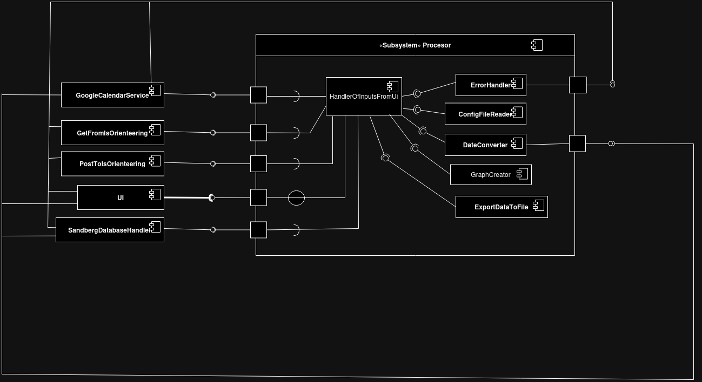

# Návrh
## 1 Úvod
## 1.1 Účel návrhu
Tento dokument slúži ako detailný návrh informačného systému pre projekt “Aplikácia pre import a export údajov z databázy termínov pretekov”. Systém je vyvíjaný pre Športový klub Sandberg a je súčasťou predmetu Tvorba informačných systémov na FMFI UK v akademickom roku 2024/2025. Dokument obsahuje všetky potrebné informácie týkajúce sa implementácie, fungovania a dizajnu systému. Je určený predovšetkým pre vývojárov, ktorí budú systém realizovať a zahŕňa všetky požiadavky uvedené v katalógu požiadaviek.

## 1.2 Rozsah využitia systém
Tento dokument je úzko prepojený s katalógom požiadaviek a špecifikuje všetky požiadavky, ktoré sú v ňom uvedené. Okrem toho definuje vonkajšie rozhrania, formáty súborov a potrebné API pre správnu funkčnosť systému. Dokument tiež obsahuje návrh používateľského rozhrania konzolovej aplikácie vrátane vizualizácií a diagramov, ktoré detailne popisujú implementáciu systému.

## 1.3 Referencie
- Github repozitár projektu zameraného na tvorbu systému Športového klubu Sandberg z roku 2017: 
    [https://github.com/TIS2017/SportovyKlub](https://github.com/TIS2017/SportovyKlub)
- Github repozitár projektu z roku 2023, ktorí menili časť databázy:
    [https://github.com/TIS2023-FMFI/sportovy-pretek-web](https://github.com/TIS2023-FMFI/sportovy-pretek-web)
- [API roznhranie is.orientering.sk](https://github.com/TIS2024-FMFI/preteky/tree/main/API/is.orienteering.sk)
## 2 Návrh komunikácie medzi konzolovou aplikáciou a stránkou is.orienteering.sk 
V tejto kapitole sa venujeme komunikácí so stránkou [is.orieteering.sk](is.orienteering.sk) pomocou restfull API. Všetku komunikáciu vieme rozdeliť na dva módy: Get a Post. Komunikácia je zabezpečená skrz bezpečnostný klúč ktorý je uložený v config súbore

#### Mód Get
- používame keď získavame dáta z is.orienteering.sk
- na každý request bude samostantná funkcia
- funkcie vracajú JSON string
- ako parametre funkcí vkladamáme udaje na zaklade ktorých chceme dáta z is.orienteering.sk filtrovať
- requesty:
	- preteky v mesiaci
    		- podla mesiaca, ktorý zadáme	 
    	- registracie (registrovaný pretekáry) v danom klube
    		- podla id klubu
	- detailné informácie o pretekárovy
 		- podla id pretekara
   	- detaily pretekov
   		- podla id pretekov
   	- vysledky pretekára v intervale medzi dvoma dátumami
   		- podla id pretekara
   	 	- datumy sú vo formáte YYYY-MM-DD
  	- výledky preteku
  		- podla id pretekov a id eventu
  	- registrácia klubu na pretek
  		- podla id pretekov a id klubu
  	- kategorie na ktoré sa bežec môže prihlásiť
  		- podla id registracie pretekara a id eventu
  	- zoznam všetkých kategórii s detailami      
#### Mód Post
- používame keď vkladáme dáta na is.orienteering.sk
- na každý request bude samostantná funkcia
- ako parameter vkladame id pretekov a data nakonfigurované v JSON stringu
- funkcie vracaju JSON string s informaciou o registracii alebo True pri zrušení registrácie pretekara
- requesty:
    - registrácia pretekára na preteky
    - zrušenie registrácie pretekára na preteky
 

## 3 Návrh komunikácie medzi konzolovou aplikáciou a lokálnou databázou Sandberg
Táto kapitola predstavuje návrh komunikácie medzi konzolovou aplikáciou a lokálnou databázou Sandberg. Keďže naša aplikácia bude bežať na rovnakom serveri ako lokálna databáza Sandberg, ale bude implementovaná v inom jazyku (naša bude bežať v pythone a aplikácia Sandberg v php), je potrebný prepis a sú rôzne prístupy:

RESTful API umožňuje aplikáciám komunikovať cez HTTP protokol. Aplikácia Sandberg môže poskytovať API endpointy, ktoré naša aplikácia volá na získanie alebo odoslanie údajov. Endpointy budú spracovávať HTTP požiadavky a vracať odpovede vo formáte JSON. Tieto endpointy budú uložené v jednom PHP skripte, ktorý bude centrálnym bodom komunikácie.

**1. Implementácia v Sandberg aplikácii:**
- Na strane PHP aplikácie vytvoríme nový PHP súbor, kde budú umiestnené endpointy. Tieto endpointy budú odchytávať HTTP požiadavky z našej aplikácie a následne zavolajú príslušné funkcie na strane PHP aplikácie. Výsledky budú vrátené vo forme JSON súboru, ktorý bude odoslaný späť do našej aplikácie.
  
**2. Implementácia v našej aplikácii:**
- Aplikácia používa knižnice ako requests na volanie API endpointov a spracovanie odpovedí. Vytvoríme dva spúšťacie pythonovské skripty:
	- **Skript na import pretekov:** Tento skript bude spúšťať akciu importu vybraných pretekov. Bude posielať HTTP požiadavky na PHP aplikáciu Sandberg, ktorá spracuje tieto požiadavky a zavolá príslušné funkcie na strane PHP aplikácie.
 	- **Skript na export prihlásených bežcov:** Tento skript bude spúšťať akciu exportu prihlásených bežcov na daný pretek. Opäť bude posielať HTTP požiadavky na PHP aplikáciu Sandberg, ktorá spracuje tieto požiadavky a zavolá príslušné funkcie na strane PHP aplikácie.

Všetky funkcie, ktoré budeme potrebovať z PHP aplikácie, sú implementované v súbore [https://github.com/TIS2017/SportovyKlub/blob/master/source/preteky.php](https://github.com/TIS2023-FMFI/sportovy-pretek-web/tree/master/source).
1. Import pretekov do našej aplikácie
 - Tabuľky, ktoré sa budú používať:
  	- Preteky
  	- Kategorie
  	- Kategorie_pre
 - Funkcie:
	- pridaj_pretek($nazov, $datum, $deadline, $poznamka): Pridá nový pretek do databázy.
	- pridaj_kategoriu($nazov): Pridá novú kategóriu do databázy.
	- pridaj_kat_preteku($id_pret, $id_kat): Priradí kategóriu k preteku.
   - spracuj_pretek($competition, $categories): Táto funkcia bude spracovávať pretek a využívať ostatné funckie.
 - Vstupný formát pre funkciu pridaj_pretek bude obsahovať nasledovné parametre:
    - NAZOV (String): Názov preteku.
    - DATUM (String): Dátum preteku vo formáte YYYY-MM-DD.
    - DEADLINE (String): Deadline pre registráciu vo formáte YYYY-MM-DD.
    - POZNAMKA (String): Poznámka k preteku, ktorá môže obsahovať aj URL odkazy.

2. Export prihlásených bežcov
  - Tabuľky, ktoré sa budú používať:
    - Exporty
    - Prihlaseni
    - Pouzivatelia
    - Kategorie
 - Funkcie:
	- exportuj($id_pret)
 - Výstupný súbor je vo formáte CSV. Podrobnosti o formáte a parametre výstupu:
    - Hlavičky vo výstupe: Hlavičky v CSV súbore sú mapované z poľa prepis a budú preložené do výrazov ako "MENO", "PRIEZVISKO", "OS.ČÍSLO", "ČIP", "KATEGÓRIA", a "POZNÁMKA".
	  - Parametre:
        - meno (string): Meno prihláseného bežca 
        - priezvisko (string): Priezvisko prihláseného bežca 
	- os_i_c (string): Osobné číslo prihláseného bežca 
        - cip (string): Číslo čipu prihláseného bežca 
	- nazov (string): Kategória
	- poznamka (string): Poznámka
 - Funkcia zapisuje tieto hodnoty do CSV súboru a pripraví ho na stiahnutie.

### Komunikačný protokol

1. **Endpointy API:**
   - **POST `/api/competitions/competition`**: Tento endpoint prijíma dáta o pretekoch a kategóriách.
   - **GET `/api/competitions/{id}/export`**: Tento endpoint exportuje prihlásených bežcov pre daný pretek.

2. **Formát požiadaviek a odpovedí:**
   - **POST `/api/competitions/competition`**
     - **Požiadavka:**
       - Obsahuje JSON objekt s informáciami o preteku a kategóriách.
       - Príklad:
         ```json
         {
           "competition": {
             "nazov": "Názov preteku",
             "datum": "2024-11-28",
             "deadline": "2024-12-01",
             "poznamka": "Poznámka k preteku"
           },
           "categories": ["Kategória 1", "Kategória 2"]
         }
         ```
     - **Odpoveď:**
       - Obsahuje JSON objekt s výsledkom operácie.
       - Príklad:
         ```json
         {
           "status": "success",
           "id": 123
         }
         ```

   - **GET `/api/competitions/{id}/export`**
     - **Odpoveď:**
       - Obsahuje JSON pole s informáciami o prihlásených bežcoch.
       - Príklad:
         ```json
         [
           {
             "OS.ČÍSLO": "SKS1952",
             "KATEGÓRIA": "W-16",
             "ČIP": "2047994",
             "PRIEZVISKO": "Brňáková",
             "MENO": "Dana",
             "POZNÁMKA": ""
           },
           {
             "OS.ČÍSLO": "SKS7852",
             "KATEGÓRIA": "W-40",
             "ČIP": "2049195",
             "PRIEZVISKO": "Brňáková",
             "MENO": "Helena",
             "POZNÁMKA": ""
           },
           {
             "OS.ČÍSLO": "SKS7801",
             "KATEGÓRIA": "M-40",
             "ČIP": "2049912",
             "PRIEZVISKO": "Brňák",
             "MENO": "Martin",
             "POZNÁMKA": ""
           }
           // Ďalšie záznamy...
         ]
         ```

3. **Spracovanie požiadaviek v `api.php`:**
   - **POST `/api/competitions/competition`**
     - Požiadavka je spracovaná nasledovne:
       - Načítajú sa dáta z tela požiadavky.
       - Skontroluje sa, či obsahujú potrebné informácie o preteku a kategóriách.
       - Dáta sa spracujú pomocou funkcie `PRETEKY::spracuj_pretek`.
       - Výsledok sa vráti ako JSON odpoveď.
     - Príklad kódu:
       ```php
       if ($_SERVER['REQUEST_METHOD'] == 'POST' && preg_match('/\/api\/competitions\/competition/', $_SERVER['REQUEST_URI'])) {
           $data = json_decode(file_get_contents('php://input'), true);

           if (empty($data['competition']) || empty($data['categories'])) {
               echo json_encode(["status" => "error", "message" => "Missing data for race or categories."]);
               exit;
           }

           $result = PRETEKY::spracuj_pretek($data['competition'], $data['categories']);
           echo json_encode($result);
           exit;
       }
       ```

   - **GET `/api/competitions/{id}/export`**
     - Požiadavka je spracovaná nasledovne:
       - Načítajú sa dáta z URL.
       - Dáta sa exportujú pomocou funkcie `PRETEKY::exportujJSON`.
     - Príklad kódu:
       ```php
       if ($_SERVER['REQUEST_METHOD'] == 'GET' && preg_match('/\/api\/competitions\/(\d+)\/export/', $_SERVER['REQUEST_URI'], $matches)) {
           $id_pret = $matches[1];
           PRETEKY::exportujJSON($id_pret);
       }
       ```

## 4 Návrh "Procesora"
Táto kapitola opisuje centrálny subsystem procesor, ktorý má na starosti:
- riadenie chodu aplikácie
- prepája medzi sebou jednotlivé moduly ktoré komunikujú s vonkajším prostredím (is.orienteering.sk, Sandberg, Google kalendár, UI)
- poskytuje modulom pomocné moduly:
 	- date_converter
  		- obsahuje metody na upravovanie datumov do požadovaného formátu 
  	- error handler
  		- obsahuje metódy ktoré odchytávaju errory
  	 		- po odchytení erroru modul zabezpečí aby sa požadovaná chybová hláška vypísala v UI  
  	- config file reader
  		- zabezpečuje čítanie configuračného súboru
  	 	- súbor má nasledujúci formát:
  	
  
  
  	- file writer
  	  	- vstupné dáta sú vo formáte JSON string
  	  	- zapisuje ich do súboru
  	  	- na každý formát súboru (csv, txt, html) má samostatnú metodu
  	- graph creator
  		- vstupne dáta vo formate JSON string prekonvertuje na graf
  	 	- pre vizual grafou [pozri](https://github.com/TIS2024-FMFI/preteky/blob/main/docs/navrh.md#9-n%C3%A1vrh-zobrazenia-%C5%A1tatist%C3%ADk)
  	  	- pre každý tip grafu má samostatnú metódu   		
- okrem pomocných modulou obsahuje aj modul handlerOfInputsFromUi
	- na základe dopytu z UI volá funkcie z iných modulov
 	- modulu UI vracia dáta ktoré treba vypísať
  	- volá si pomocné moduly ak treba  


## 5. Návrh komunikácie medzi konzolovou aplikáciou a Google Kalendárom

V tejto časti popisujeme komunikáciu s Google Kalendárom, ktorá umožní automatické pridanie udalostí do kalendára admina pri prihlásení bežcov na preteky. Implementácia bude prebiehať prostredníctvom Google Calendar API, čo zabezpečí synchronizáciu medzi našou aplikáciou a kalendárom.

## 5.1 Implementácia funkčnosti

### Autorizácia a autentifikácia
Na komunikáciu s Google Calendar API je potrebný OAuth 2.0 prístupový token. Pri prvej synchronizácii sa admin prihlási do svojho Google účtu a autorizuje aplikáciu na správu jeho kalendára. Token sa následne uloží v konfiguračnom súbore alebo zabezpečenej databáze, aby sa zamedzilo opakovanému prihlasovaniu.

### Automatické vytvorenie udalosti
Po registrácii bežcov na preteky aplikácia zavolá API endpoint na vytvorenie udalosti v kalendári. Parametre udalosti, ktoré sa odosielajú cez API, zahŕňajú:
- **Názov udalosti**: Obsahuje názov pretekov.
- **Dátum a čas**: Definované podľa rozpisu pretekov.
- **Umiestnenie**: Miesto konania pretekov, ak je dostupné.
- **Poznámka**: Ďalšie informácie alebo URL odkaz na detaily o pretekoch.

### Zrušenie alebo úprava udalosti
Pri zrušení registrácie bežca alebo pri zmene údajov pretekov aplikácia automaticky aktualizuje alebo odstráni príslušnú udalosť z Google Kalendára prostredníctvom PUT (update) alebo DELETE (delete) požiadavky na daný event ID.

### Formátovanie dátumu a času
Dátumy a časy budú formátované podľa štandardu ISO 8601, ktorý vyžaduje Google Calendar API.

### Výstup a potvrdenie
Po úspešnom pridelení udalosti v kalendári API vráti ID udalosti, ktoré sa uloží pre budúce operácie (napr. zrušenie alebo úprava). Funkcia vracia bool hodnotu úspešnosti.

---

## 5.2 Replikácia a nastavenie API komunikácie

Pre úspešnú replikáciu a implementáciu tejto funkcionality postupujte podľa nasledujúcich krokov:

### 1. Vytvorenie projektu v Google Cloud Console
1. Prihláste sa na [Google Cloud Console](https://console.cloud.google.com/).
2. Kliknite na **Create Project** a vyplňte údaje o projekte (názov projektu, organizácia, lokácia).
3. Po vytvorení projektu prejdite do sekcie **API & Services > Library**.
4. Vyhľadajte **Google Calendar API** a aktivujte ho.

### 2. Nastavenie OAuth 2.0 autentifikácie
1. Prejdite do **API & Services > Credentials**.
2. Kliknite na **Create Credentials > OAuth client ID**.
3. Nastavte typ aplikácie na **Desktop App**.
4. Po vytvorení stiahnite súbor `credentials.json`, ktorý obsahuje potrebné prihlasovacie údaje.

### 3. Inštalácia potrebných knižníc
Na prácu s Google Calendar API použite nasledujúci príkaz na inštaláciu knižníc:

```bash
pip install --upgrade google-api-python-client google-auth-httplib2 google-auth-oauthlib
```

### 4. Implementácia funkcie
Kód na implementáciu funkcie autentifikácie a vytvárania udalostí je dostupný v súbore 
google_calendar_preview.py. Tento kód zabezpečuje autentifikáciu cez OAuth 2.0 a vytváranie udalostí v Google Kalendári.

### 5. Pridanie ďalších používateľov
1. V Google Cloud Console prejdite na **IAM & Admin > IAM**.
2. Kliknite na **Add** a pridajte emailové adresy testerov, pričom im pridelíte rolu **Editor** alebo **Viewer**.
3. Uistite sa, že pridávaný používateľ má prístup k zdieľaným kalendárom a správne oprávnenia.

---


## 6 Návrh dátového modelu
Dátový model je reprezentovaný entitno-relačným diagramom, ktorý ilustruje vzťahy medzi jednotlivými entitami. Entita predstavuje objekt, ktorý existuje samostatne a nezávisle od iných objektov. Vzťahy medzi entitami opisujú prepojenia a interakcie medzi týmito objektmi
Dátovy model je prevzatý z existujúcej aplikácie.


## 7 Analýza použitých technológií
- RESTful API: Na komunikáciu medzi našou aplikáciou a stránkou is.orienteering.sk, ako aj medzi konzolovou aplikáciou a lokálnou databázou Sandberg.
- HTTP protokol: Na volanie API endpointov a spracovanie odpovedí.
- JSON: Na formátovanie dát pre GET a POST požiadavky.
- OAuth 2.0: Na autorizáciu a autentifikáciu pri komunikácii s Google Calendar API.
- Google Calendar API: Na synchronizáciu udalostí medzi našou aplikáciou a Google Kalendárom.
- SQLite: Použitá v pôvodnej aplikácii pre databázové operácie.
- PHP: Použitá v pôvodnej aplikácii Sandberg.
- Python: Použitá v našej aplikácii na implementáciu rôznych funkcií a komunikáciu s API.
- Matplotlib: Na zobrazenie štatistík pretekára.
  
## 8 Návrh konzolového rozhrania
Úvodné okno, ktoré sa zobrazí


Po zvolení Import sa zobrazí výber mesiaca


Zoznam pretekov, vyobrazí sa po zvolení mesiaca v Importe, po zvolení prihlásenia na preteky a po zvolení exportu do súboru


Voľba formátu na export


Path uloženia vyexportovaného súboru (pri exporte a štatistikách)


Vyhľadávanie pretekára v štatistike


Zadávanie parametrov štatistiky


"services": [ //pole služieb, ktoré si chce objednať (1-X, v poli sú iba tie služby, ktoré si objednáva)]

Po stlačení q, ukončuje konzolovú aplikáciu


## 9 Návrh zobrazenia štatistík
Ako zobrazenie štatistík pretekára má užívateľ možnosť ich zobraziť a vyexportovať v PDF súbore za pomoci default Python knižnice MatPlotLib
### Údaje štatistiky


### Graf počtu účastí na pretekoch za mesiac


### Graf umiestnení na pretekoch, ktorých sa zúčastnil
- 1,2,3 reprezentujú miesta, zlomky (napr. 1/4) reprezentujú, že v koľkej štvrtine počtu umiestnení sa umiestnil


### Graf časového rozdielu od prvého pretekára na jednotlivých pretekoch


## 10 Diagramy
### 10.1 Use-case diagram
Slúži na pomenovanie základných hrubých používateľských scenárov a zobrazuje všetky činnosti, ktoré bude vykonávať správca systému. Diagram slúži najmä ako sumarizujúci pohľad a prehľad všetkých používateľských scenárov.


### 10.2 Component diagram 



### 10.3 Class diagram


## 11 Harmonogram implementácie a testovania

Implementáciu a testovanie rozdelíme na vlny. Každá vlna sa skladá z troch častí implementácia, testing, oprava. 
Jednotlivé vlny budú vyzerať takto:
##### 1 vlna:
- implementácia:
	- podmoduly procesora -  error handler, date_converter, config file reader
 	- UI
- testing:
 	- podmoduly procesora -  error handler, date_converter, config file reader
 	- UI
##### 2 vlna:
- implementácia:
	- Pripojenie do Google kalendara
  	- Get_mode
 	- Post_mode 
  	- Pripojenie na sandberg databazu
  		- import
  	 	- export
- testing:
	- Pripojenie do Google kalendara
	- Get_mode
 	- Post_mode
  	- Pripojenie na sandberg databazu
  		- import
  	 	- export     
##### 3 vlna
- implementácia:
	- podmodul procesora  - file writer
 	- handlerOfInputsFromUi
  		- komunikacia so vsetkymi modulmi   
  	- graph creator
- testing:
	- podmodul procesora  - file writer
 	- graph creator
  	- handlerOfInputsFromUi
  		- komunikácia so vsetkými modulmi    
##### 4 vlna
- implementácia:
	- všetky úpravy a optimalizacie kódu
- testing:
	- celkové fungovanie aplikácie    

